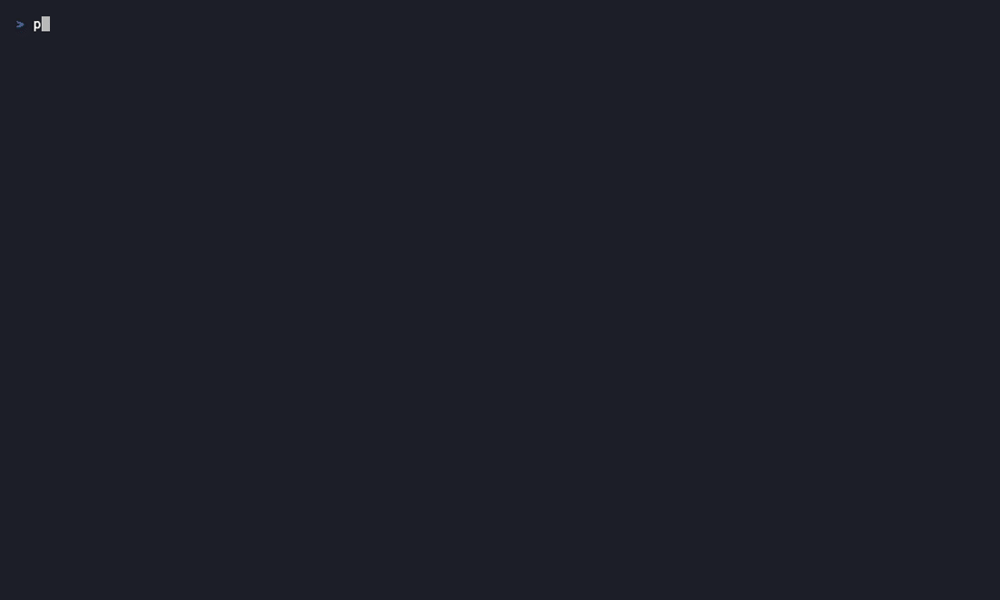

[简体中文](./README.md) · [Website](https://provena.lei6393.com) · [GitHub](https://github.com/SuperMarioYL/provena)

<picture>
  <source media="(max-width: 600px) and (prefers-color-scheme: dark)" srcset="./assets/presentation/hero-mobile-dark.svg">
  <source media="(max-width: 600px)" srcset="./assets/presentation/hero-mobile-light.svg">
  <source media="(prefers-color-scheme: dark)" srcset="./assets/presentation/hero-dark.svg">
  
</picture>

# provena

**Flag conclusions when their sources change.**

Provena records claims, source spans and claim dependencies in a graph, then propagates stale status when tracked content changes.

## Why use it

A conclusion can outlive the file fragment that supported it. Explicit dependency edges show which claims need another look when that fragment changes.

- **Explicit grounding** — Claims link to inspectable source objects.
- **Transitive invalidation** — Downstream claims inherit the need for review.
- **No model needed** — Hash comparison and graph traversal are deterministic.

## Architecture

<picture>
  <source media="(max-width: 600px) and (prefers-color-scheme: dark)" srcset="./assets/presentation/architecture-mobile-dark.svg">
  <source media="(max-width: 600px)" srcset="./assets/presentation/architecture-mobile-light.svg">
  <source media="(prefers-color-scheme: dark)" srcset="./assets/presentation/architecture-dark.svg">
  
</picture>

record_claim registers source spans and edges in ClaimDependencyGraph. CascadeEngine compares current source hashes with recorded hashes, then traverses reverse claim dependencies to mark affected conclusions stale. The optional UI displays that state.

| Component | Responsibility |
| --- | --- |
| `Source spans` | provena/core/source.py |
| `Claim graph` | provena/core/graph.py |
| `Mutation check` | provena/core/cascade.py |
| `Stale claims` | Local graph / UI |

## Install and quickstart

Build with the version declared in the repository manifest. Run the example from the repository root.

```bash
git clone https://github.com/SuperMarioYL/provena.git
cd provena
uv venv .venv
uv pip install --python .venv/bin/python -e .
source .venv/bin/activate
```

Create a temporary one-line source and two dependent claims, edit limit=10 to limit=20, then inspect the propagated status.

```bash
.venv/bin/python examples/presentation-demo.py
```

## Recorded demo

<picture>
  <source media="(max-width: 600px) and (prefers-color-scheme: dark)" srcset="./assets/presentation/process-mobile-dark.svg">
  <source media="(max-width: 600px)" srcset="./assets/presentation/process-mobile-light.svg">
  <source media="(prefers-color-scheme: dark)" srcset="./assets/presentation/process-dark.svg">
  
</picture>

Changing the source marks both limit and request claims stale.

```text
before: {"limit": "fresh", "request": "fresh"}
flagged: ['limit', 'request']
after: {"limit": "stale", "request": "stale"}
```

The complete command and output are recorded in [docs/demo-results.json](./docs/demo-results.json). Inputs and reproduction code are included in the repository.



The existing recording is retained for context; the text example above documents the reproducible scenario.

## Usage

The CLI exposes the following operations. Commands after the example use your own paths or identifiers.

```bash
provena graph --json
provena check
# Interactive local demo server:
provena demo
```

## Configuration

Use FileSpan.from_file(path, start, end) to capture a source span. record_claim accepts grounded_on source objects or registered IDs and depends_on claim IDs. Integrations should own graph persistence and re-derivation after receiving stale flags.

## Integrations and responsibilities

<picture>
  <source media="(max-width: 600px) and (prefers-color-scheme: dark)" srcset="./assets/presentation/integrations-mobile-dark.svg">
  <source media="(max-width: 600px)" srcset="./assets/presentation/integrations-mobile-light.svg">
  <source media="(prefers-color-scheme: dark)" srcset="./assets/presentation/integrations-dark.svg">
  
</picture>

The following routes are implemented in the source. Choose the input that matches your task and keep the resulting artifact with your project.

| Route | Implemented role |
| --- | --- |
| FileSpan | Tracked file line ranges |
| Claim recording | Grounding and dependencies |
| Cascade callback | Application notification seam |
| JSON / local UI | Graph inspection |

## Limits and next steps

- The engine flags claims for review; it does not automatically re-derive or correct them.
- A recorded dependency is supplied by the caller and does not prove the source actually supports the claim.
- File line spans can shift after edits. Source selection and graph completeness affect the usefulness of invalidation.

Automatic re-derivation and broader source adapters are future integration work. The current core owns recording and stale propagation.

## License and contributions

See [LICENSE](./LICENSE). When reporting an issue, include a minimal input, the command, and the observed output.
