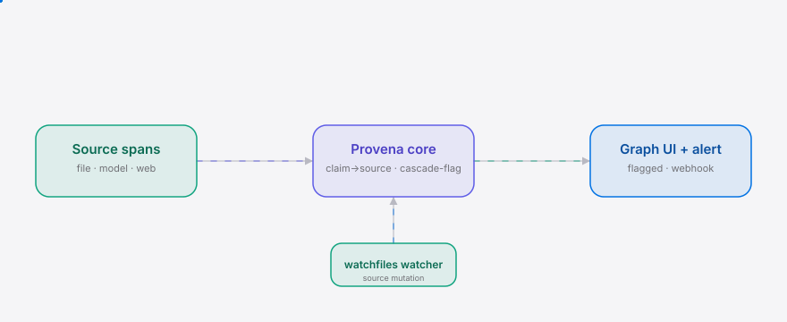

<div align="right"><sub>[English](./README.en.md)&nbsp;&nbsp;⇄&nbsp;&nbsp;<b>简体中文</b></sub></div>

<p align="center">
<picture>
  <source media="(prefers-color-scheme: dark)" srcset="./assets/hero-dark.svg">
  <source media="(prefers-color-scheme: light)" srcset="./assets/hero-light.svg">
  
</picture>
</p>

<p align="center"><sub>Provena 是给长程代理团队的来源溯源层：来源一变，依赖结论即被级联标记失效。</sub></p>

<p align="center">
  <a href="./LICENSE"></a>
  <a href="https://github.com/SuperMarioYL/provena/releases"></a>
  <a href="https://github.com/SuperMarioYL/provena/actions/workflows/ci.yml"></a>
  
</p>

**代理每条结论都回链到机器可查的来源片段；来源一变（文件编辑、模型替换、网页更新），依赖结论即被级联标记失效并触发重新推导，全部在一张来源-结论图上可见。**

<h2> 架构</h2>

<p align="center">
<picture>
  <source media="(prefers-color-scheme: dark)" srcset="./assets/atlas-dark.svg">
  <source media="(prefers-color-scheme: light)" srcset="./assets/atlas-light.svg">
  
</picture>
</p>

核心原语是 **ClaimDependencyGraph**：节点是*结论*（claim，代理发出的判断）和*来源*（source，机器可查的片段），两种边：

- `grounded_on`：结论 → 来源（这条结论是从这个片段推导出来的）
- `depends_on`：结论 → 结论（一条结论建立在另一条之上）

来源发生变更时，引擎把直接接地在该来源上的结论标记为 `stale`，并沿 `depends_on` 边**传递地**标记失效——把 Bazel 的 dirty-mark 从代码图节点提升到*代理结论*节点。失效单位是代理发出的*结论*，而不是文件或代码图节点。

## 目录

- [为什么需要它](#为什么需要它)
- [安装与快速开始](#安装与快速开始)
- [用法](#用法)
- [Demo](#demo)
- [路线图](#路线图)
- [许可](#许可)

## 为什么需要它

当一个代理结论所依赖的来源事实发生变更（函数签名被重构、模型被替换、网页被更新），所有下游结论会**悄悄失效**，而现有工具都不会重新标记它们——代理继续在已经不成立的结论上推理。这正是 *Verschlimmbesserung*（一个让事情变更糟的"改进"）所命名的痛点：上游一变，下游静默退化。

Provena 把每条结论回链到**机器可查的来源片段**（一个数据流代理，而非黑盒解释），并在来源变更时级联标记依赖结论为失效，在一张来源-结论图上可见。如果它存在，失效的结论就不再是静默的——地面一变，它们就被标记并触发重新推导。

## 安装与快速开始

```bash
git clone https://github.com/SuperMarioYL/provena && cd provena
pip install -e .
provena demo            # 打开 http://127.0.0.1:8000，编辑 provena/demo/source.py → 依赖结论变红
```

> 国内用户可走 Gitee 镜像：`git clone https://gitee.com/SuperMarioYL/provena`。
> 也可用 `uv run provena demo`（需要 [uv](https://docs.astral.sh/uv/)）。

<details>
<summary>样例输出（provena demo）</summary>

```
Provena demo — http://127.0.0.1:8000
edit the source to flag dependents: .../provena/demo/source.py
watching .../provena/demo/source.py for mutations (live edit -> flag)
graph ready: 5 claims, 5 sources
# 编辑 parse_config 的签名后：
[cascade] 2 claim(s) flagged stale by file:.../source.py:15-17
  - claim_....  `parse_config` is defined at ...:15-17 ...
  - claim_....  The module exposes a stable public surface of callables ...
```
</details>

## 用法

<h3> 子命令</h3>

```bash
# 打印 claim→source DAG（m1 完成判据）
provena graph --json

# 解释一条结论的来源回链（它接地在哪些片段 + 依赖哪些结论）
provena trace <claim_id>

# 把工作区与 git 基线对比，列出失效的结论（编辑文件后运行）
provena check

# 启动玩具代理 + 本地图服务 + 文件监听（编辑 → 标记 → 告警）
provena demo
```

编程接口同样直接：

```python
from provena.core.graph import ClaimDependencyGraph
from provena.core.provenance import record_claim
from provena.core.source import FileSpan

g = ClaimDependencyGraph()
span = FileSpan.from_file("kb.py", 1, 2)
claim = record_claim(g, "`parse_config` 返回 dict。", grounded_on=[span])
print(g.to_json(indent=2))
```

更多示例见 [`examples/`](./examples)。

## Demo

<h3> 编辑来源 → 依赖结论被级联标记</h3>


编辑 `provena/demo/source.py` 中代理结论所引用的函数签名；`provena check` 把接地在该片段上的结论及其依赖标记为失效。

## 路线图

<h3> 里程碑</h3>

- [x] **m1** — claim→source 数据模型 + provenance 记录；玩具代理发出可图查询的结论（`provena graph --json`）
- [x] **m2** — 文件变更检测（watchfiles）+ 依赖 DAG 上的传递失效标记（`provena check`）
- [x] **m3** — FastAPI + vis-network 图视图，标记节点高亮 + 点击查看来源片段（`provena demo` 端到端 <10 分钟）

**未来（v0.1 明确不在范围内）：**

- 真实代理框架插件（Claude Code / Cursor / LangChain）—— v0.1 仅玩具脚本代理
- 执行重新推导（自动重跑代理）—— v0.1 仅标记，不自动重推导
- 持久化存储 / 数据库 —— 仅内存图
- 多用户 / 鉴权 / 云托管 / SSO
- 协作或超出单用户本地图视图的看板
- 完整 OpenTelemetry GenAI collector 流水线 —— 建模的 span，而非真实 collector
- 企业许可 / 真实计费系统（告警 webhook 是预览付费层的桩）
- 自训练模型 / ML
- 网页来源与模型版本变更监听器（仅文件片段；model/web 为桩接口）

**商业路径：** 免费 OSS 核心（MIT）+ 托管团队付费层（托管来源-结论图存储 + 级联看板 + 飞书/Slack 告警）。demo 里的告警 webhook 桩即付费层的预览。

**终止判据：** 上线 GitHub + Gitee 满一个月并完成 3 场发布活动后，若双平台合计 <50 star、且无用户尝试将 Provena 接入真实代理的有机 issue、且 5 次预访谈中 <2 人愿意接入，则放弃。一个没人接入的原语不是生意——即使有 star。

## 许可

MIT — 见 [`LICENSE`](./LICENSE)。提 issue 或 PR 欢迎：[issues](https://github.com/SuperMarioYL/provena/issues)。

<p align="center"><sub><a href="./LICENSE">MIT</a> © 2026 SuperMarioYL</sub></p>
